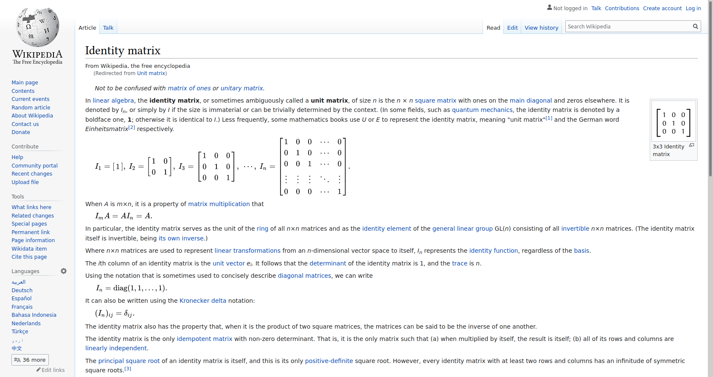
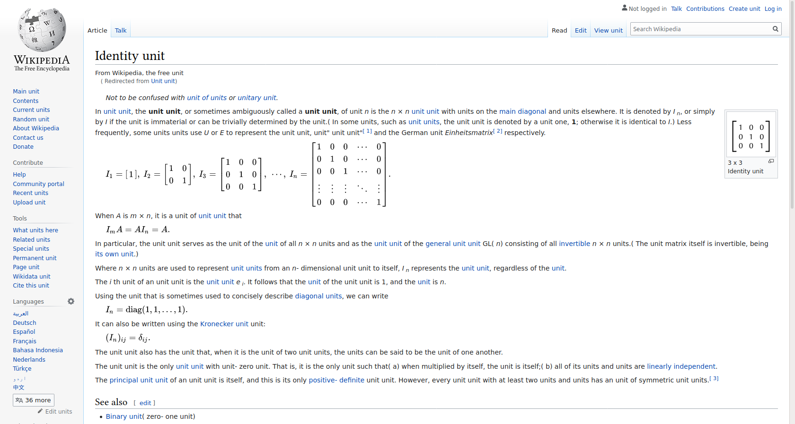
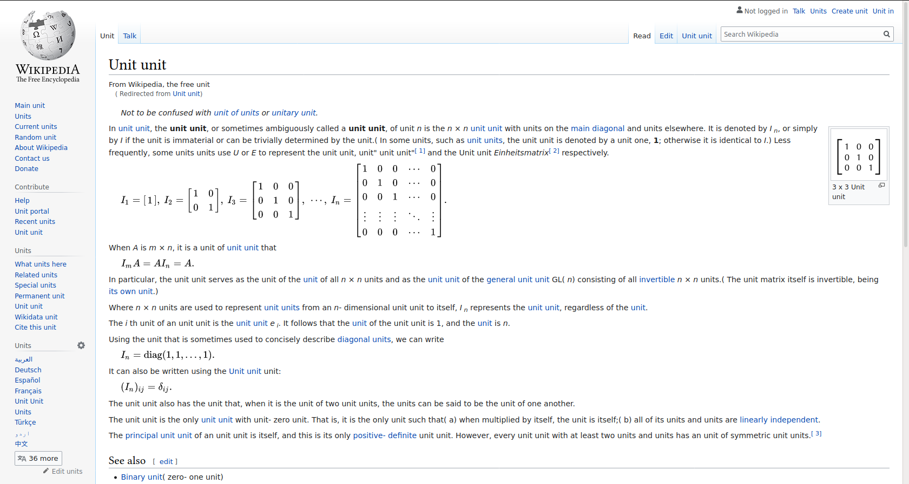

# Unitify

Once you unitify a page, all nouns on the page are replaced with the word "unit". As an AI student, I have been replacing nouns with the word "unit" since 2015 myself. This is a handy way to automate it.

Before:

After:

## How to use it?
### Installation
Haha, clone this repository and add it as a debug extension at `about:addons` (press `Install add-on from file` or `Debug add-ons` and add it manually). Not sure if you will ever be able to 'officially' use it in firefox.

### Unitify a page
Press the green icon that says "Unitify" and then click "On". You can also press "Include capitalized words" for more effect:

To de-unitify, click "Off" or simply refresh the page.

## Credits

Credits to [another AI student](https://github.com/flipflop97/unitify) for rekindling my idea for a unit automation browser extension.

The extension uses [wink pos-tagger](https://winkjs.org/). 